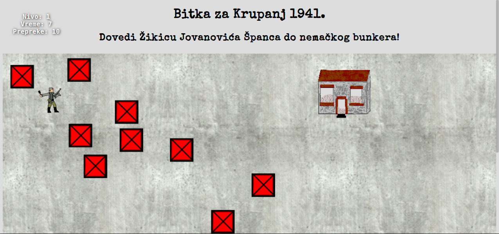

# Igrica partizani

Male igrice o Nemcima i partizanima.

Razvojna verzija je ovde: https://mudroljub.github.io/igrica-partizani/

## Instalacija

Prvo instaliraj [node.js](https://nodejs.org), noviju verziju. Nakon toga kloniraj repo i instaliraj zavisnosti:
```
git clone
npm install
git submodule init
git submodule update
```
Da pokreneš igru u razvojnom modu ukucaj:
```
npm start
```
Browser će se automatski osvežavati svaki put kada sačuvaš izmenu.

P.S. ako izbacuje grešku proveri jel već pokrenut webpack-dev-server.

## Uraditi:
- odvojiti 3 podmodula: game-ui, game-engine i game-assets
- staviti svima default export
- odvajati zajednicke metode u akcije (kompozitni obrazac)
- dodati fiziku
- napraviti Kameru
- redukovati css

### Faza 1: refaktor i sredjivanje
- Avionce: promeniti zvuk motora
- spojiti ranjenike
- preimenovati u ranjenici na sutjesci
- spojiti tenkic dva igraca i tenkic protiv kompa, jedina razlika je mrdaNasumicno
- spojiti 2d-odozgo/Oblak i 2d-bocno/Oblak?
- spojiti savo-dan i savo-noc

- TenkBocnoIgrac: odvojiti klasu Granata
- TenkOdozgo: popraviti patroliranje (vidi Bekstvo iz Jasenovca)
- TenkOdozgo: spojiti sa TenkIgracOdozgo
- camac: popraviti odbijanje
- da svi ispaljuju više projektila (radi na Avionce.js)

- razloziti proveriGranice na posebne metode?
- Humel: dodati sliku gori

### Faza 2: uvodjenje fizike
- klasa Priroda
- Priroda nameće sile okruženja (gravitaciju, inercija) predmetima
- Priroda se opire kretnju predmeta - po tlu trenjem, kroz vodu i vazduh: vučenjem
- dodati predmetima masu i ostalo
- kada top ispali projektil, projektil ispali njega (zakon akcije i reakcije)
- da scena sama radi update svih predmeta na njoj

### Faza 3: 3D
- dodati predmetima z osu (default 0)
- spojiti predmete razlicitih perpsektiva u jedan predmet (bocno, odozgo, prvolice..) sa više prikaza
- srediti 3D koliziju
- napraviti jednu mapu sa tri prikaza

## Izvori za slike
- https://commons.wikimedia.org/wiki/Category:Aircraft_profile_drawings
- https://commons.wikimedia.org/wiki/Category:SVG_profile_drawings_of_armored_fighting_vehicles
- https://commons.wikimedia.org/wiki/Category:SVG_aircraft
- https://commons.wikimedia.org/wiki/Category:Line_drawings_of_the_Messerschmitt_Bf_109
- https://commons.wikimedia.org/wiki/Category:Fiat_CR_42_Falco
